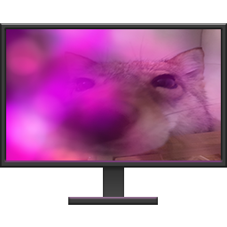

# Ambient Monitor
Application that will turn your extra monitors into ambient lighting displays, allowing you to focus solely on your games or video.

  

For multi-monitor setups, run multiple instances.

# NOTICE!!
i'm not done developing this :3c if you want to see progress or planned features, you can follow this link:
https://tree.taiga.io/project/bridgebucket-ambient-monitor/kanban

when i'm finished developing my version of this script, I will also compile it into a .exe, just like original author.

# Setup
This script requires several packages to function. In order from most to least important, here is a list:
    - PyQt5 (The better method of making GUIs)
    - PIL (Used for snatching colors off of your main monitor)
    - configparser (used for taking settings from settings.ini file)
    - sys (running and exiting the program)
    - numpy (i hate math so so much oh my GOD)
    - cv2 (used for blurring n shit later down the road :3)
    - colorama (so worthless but also so cool so why not right like ahaha)
    - os (im not even sure im just reading off the imports list i didnt mean to add this one lmafo)

I can't wait to finish this script so I can release a compiled exe that makes running this program a piece of pie!!

## Controls:
NONE and i think it was stupid that these were included in the original rather than just being able to right click on the window and get a cool ass context menu with all these settings

##
glhf everybody!! gll!!! gl!! have fun!!!! good luck good fun have luck!!!!!!!!!1!!!!!1